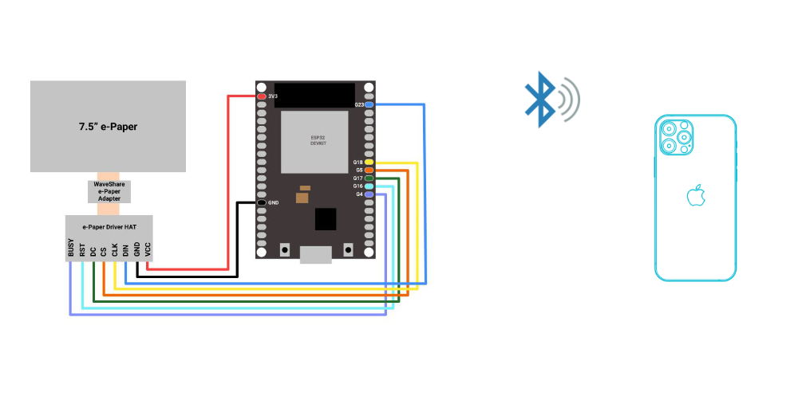

# iOS to ESP32 with BLE

The basis of the project uses Bluetooth communication for iOS devices and an ESP32 electronic module with a connected ePaper display.

The basic project can be extended as:
- interactive conference tag
- interactive price tag / QR code for payment
- system / analytics dashboard
- and much more ..

Schematics

